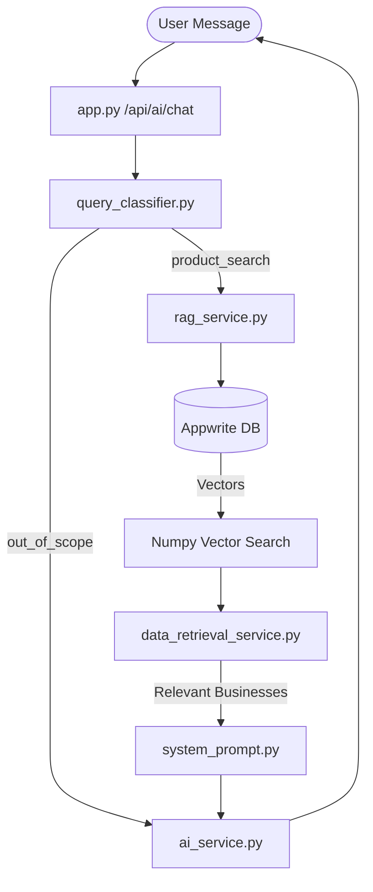

# Architecture

Ekthaa AI Assistant backend architecture overview.

## Design Pattern: RAG (Retrieval Augmented Generation)
The system follows a standard RAG pattern optimized for business discovery. It uses external vector storage and a local processing pipeline to ground the AI's responses in real business data.

## Processing Pipeline
1. **API Layer**: `app.py` receives a POST request with a user message.
2. **Classification**: `query_classifier.py` determines if the query is a service/product search (`product_search`) or something else (`out_of_scope`).
3. **Context Retrieval**:
   - `context_builder.py` gathers user history and conversation state.
   - `rag_service.py` performs a semantic search over the `GLOBAL_BUSINESS` vector database using Appwrite as the backend.
4. **Refinement**: `data_retrieval_service.py` uses an AI model (Llama 3) to filter the search results for pinpoint relevance based on a specific retrieval prompt.
5. **Prompt Engineering**: `system_prompt.py` constructs a high-context prompt containing the refined business data, user history, and system instructions.
6. **Generation**: `ai_service.py` calls the Groq API to generate a final response in the appropriate language.
7. **Response**: The Flask server returns the AI's answer along with metadata (e.g., detected language).

## Layer Abstractions
- **BaaS (Appwrite)**: Offloads user management, authentication, and vector storage.
- **Service Layer**: Decoupled modules for AI (`ai_service.py`), RAG (`rag_service.py`), and context building (`context_builder.py`).
- **Logic Layer**: Rule-based normalization and classification.

## Data Flow Diagram

---
*Last mapped: 2026-04-11*
